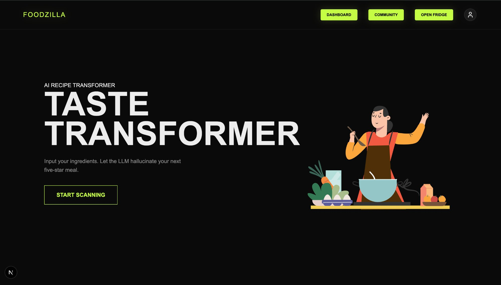
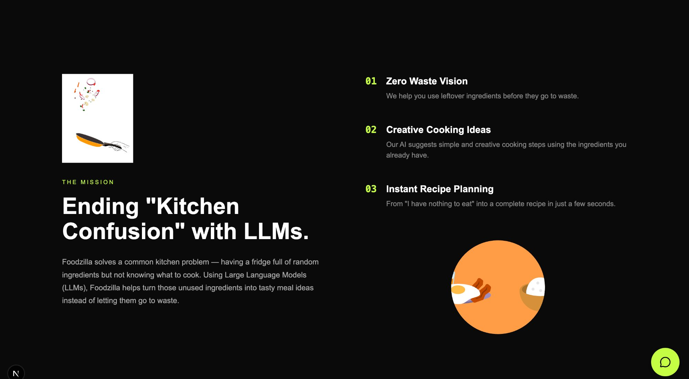
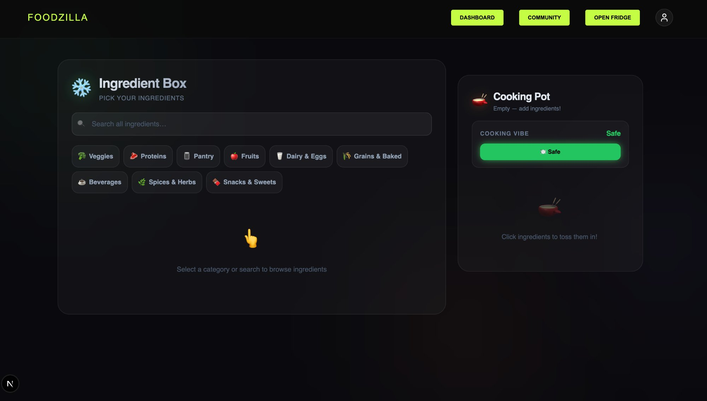
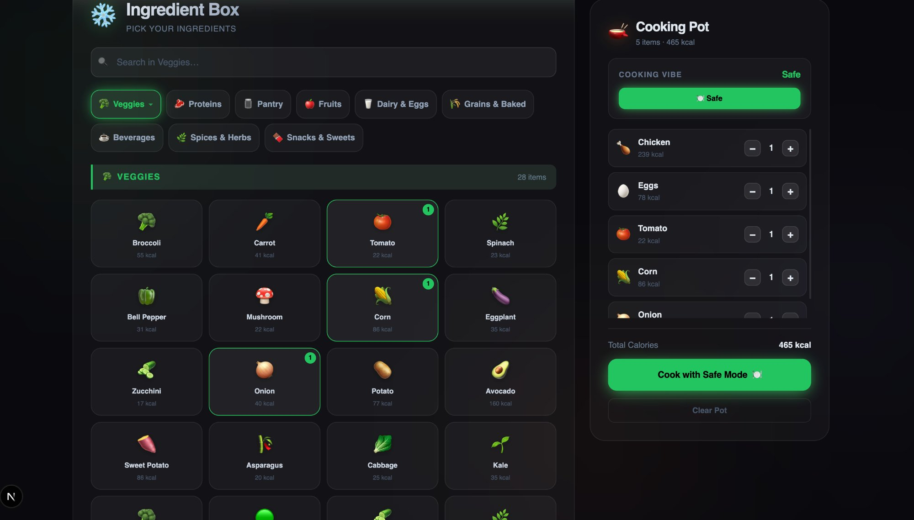
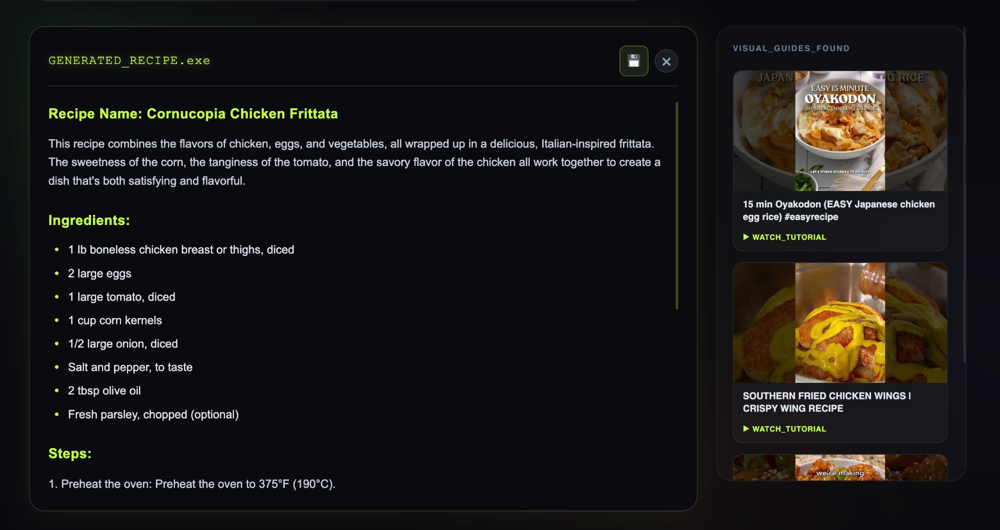
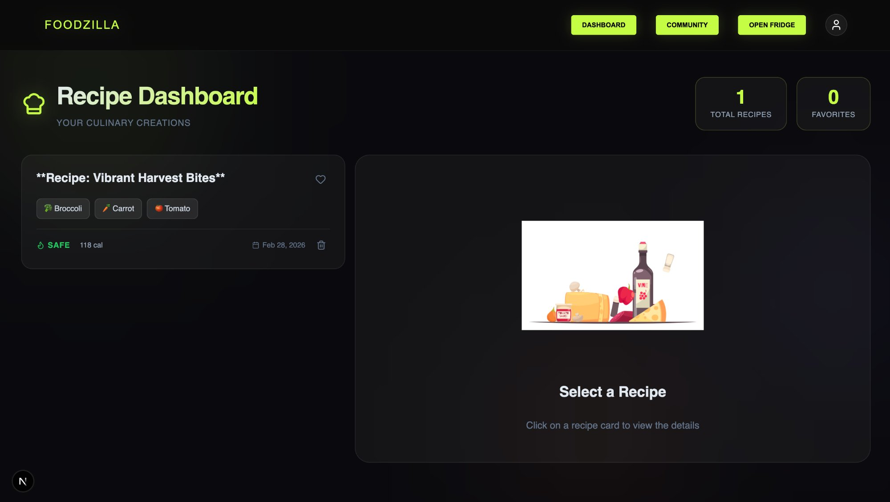
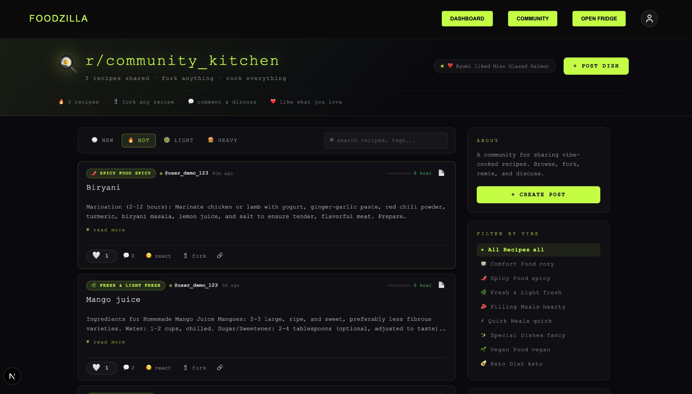

<div align="center">

```
███████╗ ██████╗  ██████╗ ██████╗ ███████╗██╗██╗     ██╗      █████╗
██╔════╝██╔═══██╗██╔═══██╗██╔══██╗╚══███╔╝██║██║     ██║     ██╔══██╗
█████╗  ██║   ██║██║   ██║██║  ██║  ███╔╝ ██║██║     ██║     ███████║
██╔══╝  ██║   ██║██║   ██║██║  ██║ ███╔╝  ██║██║     ██║     ██╔══██║
██║     ╚██████╔╝╚██████╔╝██████╔╝███████╗██║███████╗███████╗██║  ██║
╚═╝      ╚═════╝  ╚═════╝ ╚═════╝ ╚══════╝╚═╝╚══════╝╚══════╝╚═╝  ╚═╝
```

**AI-powered recipe generator · community feed · fridge-to-table cooking**

[](https://nextjs.org/)
[](https://mongodb.com)
[](https://typescriptlang.org)
[](https://tailwindcss.com)
[](CONTRIBUTING.md)

</div>

---

## 🍳 What is Foodzilla?

**Foodzilla** turns your leftover ingredients into AI-generated recipes — and lets you share them with a community of home cooks. It solves a universal kitchen problem: *a fridge full of random stuff, and no idea what to make.*

Open the fridge → pick ingredients → let the LLM cook → share with the world.

```
fridge scan  →  ingredient pot  →  AI generation  →  community feed
```

---

## 📸 Screenshots

### 🏠 Landing Page
> *"Let the LLM hallucinate your next five-star meal."*



---

### 💡 The Mission
> Ending kitchen confusion with LLMs — zero waste vision, instant recipe planning.



---

### 🧊 Open Fridge — Ingredient Picker
> Browse by category or search. Click to toss ingredients into your Cooking Pot.



---

### 🍲 Cooking Pot — Ingredient Selection
> 28 veggies, proteins, pantry staples and more. Calorie tracking built in.



---

### 🤖 AI-Generated Recipe Output
> `GENERATED_RECIPE.exe` — full ingredient list, numbered steps, and YouTube visual guides on the side.



---

### 📊 Recipe Dashboard
> Your personal culinary history. All saved recipes with calorie counts, ingredients, and dates.



---

### 🌍 r/community_kitchen
> Reddit-style community feed. Post dishes, fork recipes, react, comment, and discover what others are cooking.



---

## ✦ Features

### 🤖 AI Core
| Feature | Description |
|---|---|
| 🧠 **LLM Recipe Generation** | Sends your selected ingredients + vibe to an LLM and gets back a full recipe with steps |
| 🎛️ **Cooking Vibes** | Choose from Safe, Spicy, Vegan, Keto, and more to steer the AI output |
| 📺 **Visual Guides** | YouTube tutorials auto-fetched alongside every generated recipe |
| 💾 **Save Recipes** | One-click save to your personal dashboard |

### 🌍 Community Kitchen
| Feature | Description |
|---|---|
| 🍴 **Fork System** | Clone any public recipe into your private kitchen and remix freely |
| ❤️ **Likes + Floating Hearts** | Tap like and watch a heart float off the screen with a bouncy pop animation |
| 😍 **Reaction Bar** | 6-emoji reaction picker per post with community totals |
| 💬 **Comments** | Inline comment threads per recipe — press Enter or ↵ to submit |
| 📋 **Smart Instructions** | Numbered steps auto-parsed into `<ol>` — plain text falls back gracefully |
| 🔖 **Bookmarks** | Client-side save toggle with visual feedback |
| 🟢 **Live Activity Ticker** | Animated header feed of community actions, refreshes every 3.5s |
| 🔥 **Calorie Meter** | Per-recipe inline progress bar — green → yellow → red |
| ⌕ **Debounced Search** | 400ms debounce, queries recipe names + ingredient names |
| 🎛️ **Sort + Vibe Filters** | NEW / HOT / LIGHT / HEAVY sorts + 8 vibe categories |
| 🆕 **New Post Animation** | Freshly posted recipes slide in with green highlight border + badge |
| 🔔 **Toast Notifications** | Bottom-center toasts for all community actions |

---

## 🗂️ Project Structure

```
app/
├── page.tsx                    ← Landing page (hero + mission)
├── dashboard/
│   └── page.tsx                ← Personal recipe dashboard
├── community/
│   ├── page.tsx                ← r/community_kitchen feed
│   └── community.module.css    ← Monospace dark theme styles
│
api/
├── community/
│   └── route.ts                ← GET feed · POST like/fork/comment/publish
├── recipes/
│   └── route.ts                ← Recipe save / fetch
└── generate/
    └── route.ts                ← LLM recipe generation endpoint
│
models/
├── recipeModel.ts              ← Mongoose schema
└── commentModel.ts             ← Comment schema
│
dbConfig/
└── dbConfig.ts                 ← MongoDB connection
```

---

## 🚀 Getting Started

### Prerequisites

- **Node.js** `18+`
- **MongoDB** Atlas cluster (or local)
- An LLM API key (OpenAI / Anthropic / etc.)

### Install & Run

```bash
# 1. Clone the repo
git clone https://github.com/your-username/foodzilla.git
cd foodzilla

# 2. Install dependencies
npm install

# 3. Set up environment variables
cp .env.example .env.local
# Fill in your keys (see below)

# 4. Run the dev server
npm run dev
```

Open [http://localhost:3000](http://localhost:3000) 🍳

### Environment Variables

```env
# .env.local

MONGODB_URI=mongodb+srv://<user>:<password>@cluster.mongodb.net/foodzilla

# LLM provider (whichever you use)
HF_API_KEY=hf-...
# or


# YouTube Data API (for visual guides)
YOUTUBE_API_KEY=AIza...

# NextAuth (if using auth)
TOKEN_SECRET=your-secret

```

---

## 🧠 How the AI Works

```
User selects ingredients + cooking vibe
         ↓
POST /api/generate
         ↓
Prompt: "Generate a recipe using [ingredients] with a [vibe] style.
         Return: name, ingredients list, numbered steps."
         ↓
LLM Response parsed → saved to MongoDB
         ↓
YouTube API queried for visual tutorial matches
         ↓
GENERATED_RECIPE.exe displayed ✓
```

The recipe is saved with the schema field `steps` (plain text) and `ingredients` (array with emoji + calories). The community feed maps `steps → instructions` for display.

---

## 🗄️ Data Model

### Recipe

```typescript
{
  authorId:       String,     // user who created it
  recipeName:     String,     // "Cornucopia Chicken Frittata"
  ingredients:    [{ name, emoji, quantity }],
  steps:          String,     // full recipe text / numbered steps
  recipeText:     String,     // raw LLM output
  vibe:           String,     // "Safe" | "Spicy" | "Vegan" | "Keto" ...
  totalCalories:  Number,
  isPublic:       Boolean,    // true = appears in community feed
  likes:          [String],   // userIds
  likesCount:     Number,
  parentRecipeId: String,     // set if forked from another recipe
  videos:         [{ videoId, title, thumbnail }],
  isFavorite:     Boolean,
}
```

### Comment

```typescript
{
  recipeId:  ObjectId,
  authorId:  String,
  text:      String,
  likes:     [String],
  createdAt: Date,
}
```

---

## 🤝 Contributing

Pull requests are welcome! Here's how:

```bash
# Fork the repo, then:
git checkout -b feature/your-feature
git commit -m "feat: add your feature"
git push origin feature/your-feature
# Open a PR 🎉
```

Please follow the existing code style — TypeScript throughout, monospace dark theme for any new UI components.

---


<div align="center">

**Built with 🍳 and too many late-night snacks**

`fork anything · cook everything · share always`

</div>
